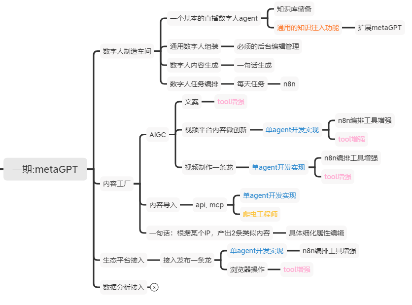

# AI Avatar Platform (commagents)

A comprehensive AI-powered avatar platform for creating, managing, and operating digital avatars for content generation and live streaming.



## Project Overview

**AI Avatar Platform** is a modular system that enables the creation and operation of intelligent digital avatars capable of autonomous content generation, real-time interaction, and multi-platform publishing. The platform leverages MetaGPT's multi-agent framework to orchestrate complex workflows involving content creation, avatar management, and ecosystem integration.

**LiveFootballAvatar** serves as the initial example implementation, demonstrating real-time football commentary generation with multiple specialized agents.

## Architecture

### 1. Avatar Manufacturing Workshop (数字人制造车间)

#### Live Avatar Agent
- Knowledge base management and dynamic knowledge injection
- Personality configuration and behavior customization
- Real-time context awareness and adaptation

#### Universal Avatar Assembly
- Backend management interface for avatar configuration
- Customizable avatar personalities, voices, and behaviors
- Scalable avatar deployment and management

#### Avatar Content Generation
- Single-phrase to complete content generation
- LLM-powered natural language processing
- Context-aware response generation

#### Avatar Task Orchestration
- n8n workflow integration for automated tasks
- Event-driven actions and scheduling
- Multi-avatar coordination and interaction

### 2. Content Factory (内容工厂)

#### Content Import Agent
- API and MCP protocol integration for content acquisition
- WebSurfer and WebCrawler tools for autonomous content discovery
- Multi-source content aggregation and processing

#### Content Generation Agent
- **Multi-source content generation**:
  - Single-phrase prompt expansion
  - Content reprocessing and micro-innovation
  - IP-style content transformation
- Tool-enhanced generation with LLM + external tools + n8n workflows

#### Video Production Pipeline Agent
- End-to-end automated video creation
- Script generation and video processing
- Integration with external video tools and services

### 3. Ecosystem Integration (生态平台接入)

#### Publishing Pipeline Agent
- Multi-platform content distribution
- Automated publishing workflows via n8n
- Platform-specific optimization and formatting

### 4. Data Analytics (数据分析)
- Live avatar performance metrics and analytics
- User engagement tracking and analysis
- Content performance optimization insights

## Key Components

### Current Implementation (LiveFootballAvatar)

#### Agent Roles

**PlayByPlay Commentator** (`agents/playbyplay_commentator.py`)
- Passionate play-by-play soccer commentary
- Vivid and energetic narration for match events
- Real-time event processing and response generation

**Tactical Analyst** (`agents/tactical_analyst.py`)
- Strategic analysis of formations and plays
- Detailed tactical explanations and insights
- Formation and strategy commentary

**Show Host** (`agents/show_host.py`)
- Discussion moderation and flow management
- Smooth transitions between commentary segments
- Audience engagement and interaction

#### Event Processing Architecture

```
[LIVE MATCH DATA] ──▶ [n8n Webhook] ──▶ [MCP / MetaGPT Agent]
                                     │
                                     │  [Generate Commentary]
                                     │  
                       ┌─────────────┴─────────────┐─────────────────────┐
                       ▼                           ▼                     ▼
             [CommentatorAgent]             [AnalystAgent]         [HostAgent]
                       │                           │                     │
                       └────────┬───────────────┬──┘─────────────────────┐
                                ▼               ▼                        ▼
                                         [Trigger Avatar API]
                                                ▼
       [Commentator Avatar Speaking Output] [Analyst Avatar]  [Host Avatar]
```

### Integration Points

#### Avatar API Integration
```json
POST /speak
{
  "text": "What a fantastic strike by Mbappé!",
  "emotion": "excited", 
  "language": "Chinese"
}
```

#### n8n Workflow
```
[Match Update Webhook] → [LLM Commentary] → [HTTP: speak_avatar] → [DUIX/Akool API]
```

#### MCP Server Integration
- Server URL: `http://localhost:8080`
- Tools: `process_match_event`, `trigger_avatar`
- Real-time function call management

## Getting Started

### Prerequisites
- Python 3.9+ (supports 3.9, 3.10, 3.11, 3.12)
- Git

### Installation

#### Option 1: pip install (Recommended)
```bash
# Clone repository
git clone <repository-url>
cd ai-avatar-platform

# Install with development dependencies
pip install -e ".[dev]"

# Copy and configure settings
cp config/config2.example.yaml config/config2.yaml
# Edit config/config2.yaml with your API keys
```

#### Option 2: conda/mamba
```bash
# Create environment from specification
conda env create -f environment.yml
conda activate ai-avatar-platform

# Copy configuration
cp config/config2.example.yaml config/config2.yaml
```

#### Option 3: Quick setup
```bash
# Run automated setup script
./setup.sh
```

### Configuration
1. Copy `config/config2.example.yaml` to `config/config2.yaml`
2. Update API keys and endpoints
3. Configure avatar settings in `config/football_avatar.yaml`

### Testing Installation
```bash
# Test infrastructure
python test_infrastructure.py

# Run example
python agents/football_commentary_team.py

# Run all tests
pytest
```

## Technology Stack

- **Framework**: MetaGPT multi-agent system
- **Language**: Python 3.8+
- **Workflow**: n8n automation platform
- **Integration**: MCP (Model Context Protocol)
- **AI/LLM**: OpenAI GPT-4, Azure OpenAI, and other LLM providers
- **Avatar**: DUIX, SenseAvatar, Akool APIs

## License

This project is licensed under the terms specified in the LICENSE file.

