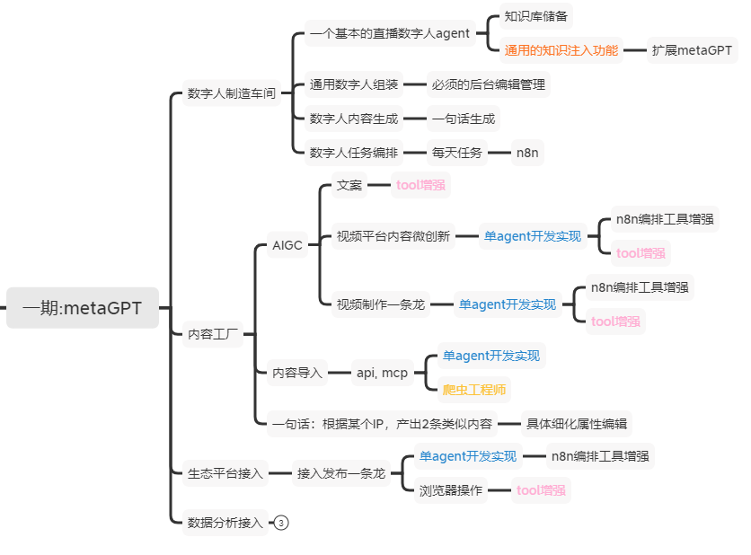

# AI数字人平台 (commagents)

一个用于创建、管理和运营数字人的综合AI平台，支持内容生成和直播流媒体。



## 项目概述

**AI数字人平台**是一个模块化系统，能够创建和运营智能数字人，具备自主内容生成、实时交互和多平台发布能力。该平台基于MetaGPT的多智能体框架，协调涉及内容创作、数字人管理和生态系统集成的复杂工作流程。

**足球直播数字人(LiveFootballAvatar)**作为初始示例实现，展示了多个专业智能体生成实时足球解说的能力。

## 架构

### 1. 数字人制造车间

#### 直播数字人智能体
- 知识库管理和动态知识注入
- 个性化配置和行为定制
- 实时上下文感知和适应

#### 通用数字人组装
- 数字人配置的后台管理界面
- 可定制的数字人个性、声音和行为
- 可扩展的数字人部署和管理

#### 数字人内容生成
- 从"一句话"到完整内容生成
- 基于LLM的自然语言处理
- 上下文感知响应生成

#### 数字人任务编排
- n8n工作流集成的自动化任务
- 事件驱动的动作和调度
- 多数字人协调和交互

### 2. 内容工厂 - 网红内容流水线

#### 网红内容采集智能体
- WebSurfer集成的多平台内容抓取
- 自动提取视频博客、图片和短视频
- 支持TikTok、Instagram、YouTube、Twitter等主要平台
- 按类型、日期和互动指标进行内容分类和组织

#### 风格分析智能体
- AI驱动的视觉和文本风格提取
- 美学模式和主题的计算机视觉分析
- 基于NLP的语调、语言和个性分析
- 网红品牌建档和趋势识别

#### 内容生成智能体
- **风格匹配的内容生成**：
  - 模仿网红表现风格的AI生成视频博客
  - 保持视觉美学一致性的图像创作
  - 匹配原始格式和语调的短视频生成
  - 具有真实声音和个性的社交媒体帖子
- **多格式创建**，跨内容类型保持品牌一致性
- **AI工具集成**：DALL-E 3、RunwayML、ElevenLabs、Midjourney APIs

#### 社交媒体发布智能体
- **多平台自动分发**到TikTok、Instagram、YouTube、Twitter
- **平台特定优化**和内容格式适配
- **基于观众互动模式的智能调度**
- **跨平台协调**同步内容发布

### 3. 生态平台接入 - 社交媒体集成

#### 社交媒体平台集成
- **多平台API支持**：TikTok研究API、Instagram图谱API、YouTube数据API、Twitter API v2
- **针对每个平台特定要求的内容格式优化**
- **带有平台特定元数据生成的自动发布工作流**
- **跨平台的互动分析**和性能优化

### 4. 数据分析
- 直播数字人性能指标和分析
- 用户互动跟踪和分析
- 内容性能优化洞察

## 核心组件

### 当前实现（足球直播数字人）

#### 智能体角色

**实况解说员** (`agents/playbyplay_commentator.py`)
- 激情的足球实况解说
- 比赛事件的生动有力的解说
- 实时事件处理和响应生成

**战术分析师** (`agents/tactical_analyst.py`)
- 阵型和战术的战略分析
- 详细的战术解释和洞察
- 阵型和策略解说

**节目主持人** (`agents/show_host.py`)
- 讨论调节和流程管理
- 解说环节间的平滑过渡
- 观众参与和互动

#### 事件处理架构

```
[实时比赛数据] ──▶ [n8n Webhook] ──▶ [MCP / MetaGPT智能体]
                                     │
                                     │  [生成解说]
                                     │  
                       ┌─────────────┴─────────────┐─────────────────────┐
                       ▼                           ▼                     ▼
             [解说员智能体]                   [分析师智能体]         [主持人智能体]
                       │                           │                     │
                       └────────┬───────────────┬──┘─────────────────────┐
                                ▼               ▼                        ▼
                                         [触发数字人API]
                                                ▼
       [解说员数字人语音输出]     [分析师数字人]      [主持人数字人]
```

### 集成点

#### 数字人API集成
```json
POST /speak
{
  "text": "姆巴佩的这一脚射门太精彩了！",
  "emotion": "excited", 
  "language": "Chinese"
}
```

#### n8n工作流
```
[比赛更新Webhook] → [LLM解说] → [HTTP: speak_avatar] → [DUIX/Akool API]
```

#### MCP服务器集成
- 服务器URL: `http://localhost:8080`
- 工具: `process_match_event`, `trigger_avatar`
- 实时函数调用管理

## 快速开始

### 前置条件
- Python 3.8+
- MetaGPT框架
- n8n工作流自动化
- 数字人API服务 (DUIX/SenseAvatar)

### 配置
1. 复制 `config/config2.example.yaml` 到 `config/config2.yaml`
2. 更新API密钥和端点
3. 在 `config/football_avatar.yaml` 中配置数字人设置

### 网红内容流水线开发命令
```bash
# 运行网红内容采集
python agents/content/influencer_harvesting_agent.py --platform tiktok --target @用户名

# 分析内容风格
python agents/content/style_analysis_agent.py --content-dir ./harvested_content/用户名

# 生成风格匹配的内容
python agents/content/content_generation_agent.py --style-profile ./profiles/用户名.json --format vlog

# 发布到多个平台
python agents/content/social_media_publishing_agent.py --content ./generated_content --platforms all

# 运行完整网红流水线
python main.py --mode influencer --target @用户名 --platforms "tiktok,instagram,youtube"
```

### 当前示例（足球直播数字人）
```bash
# 运行足球解说系统
python agents/football_commentary_team.py

# 运行当前实现的测试
python test_commentary.py
```

## 技术栈

- **框架**: MetaGPT多智能体系统
- **语言**: Python 3.8+
- **工作流**: n8n自动化平台
- **集成**: MCP (模型上下文协议)
- **AI/LLM**: OpenAI GPT-4, Azure OpenAI和其他LLM提供商
- **数字人**: DUIX, SenseAvatar, Akool APIs

## 许可证

本项目根据LICENSE文件中指定的条款授权。